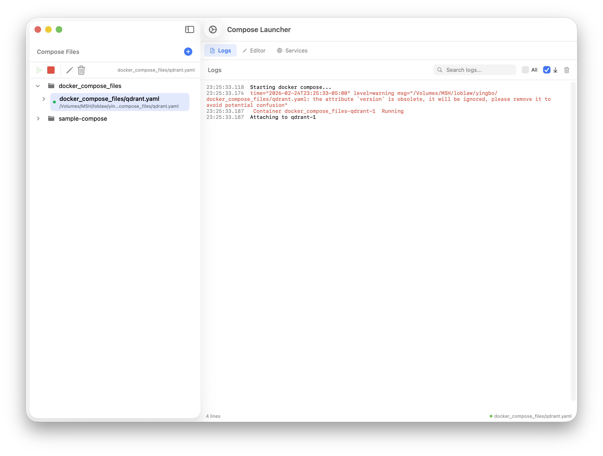
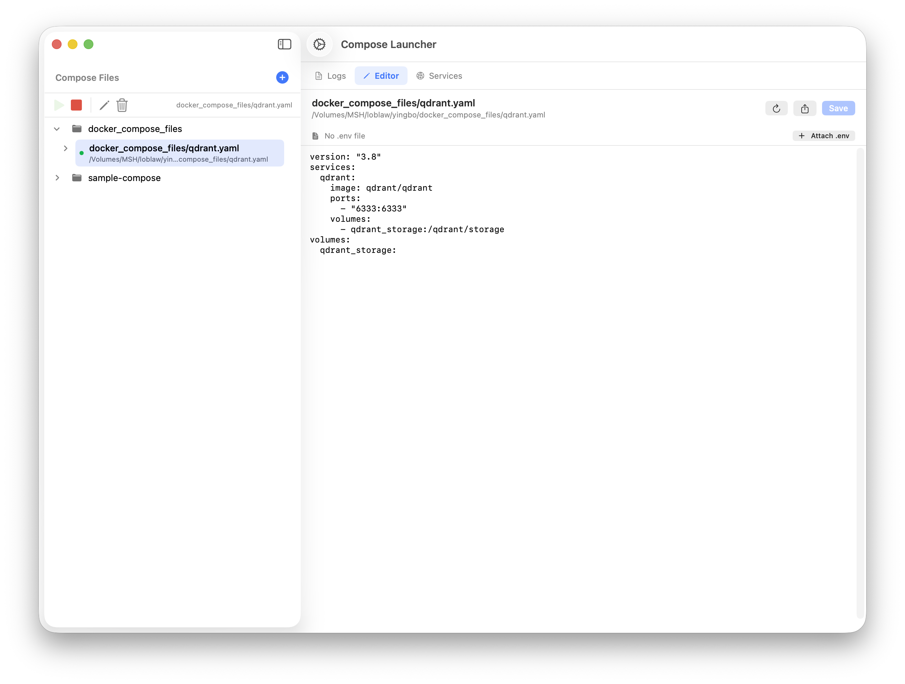
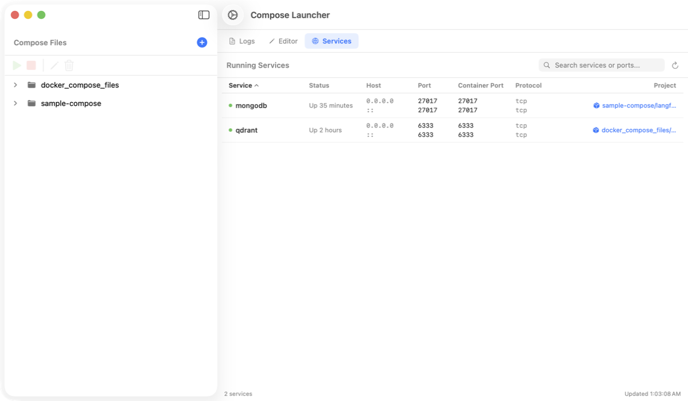
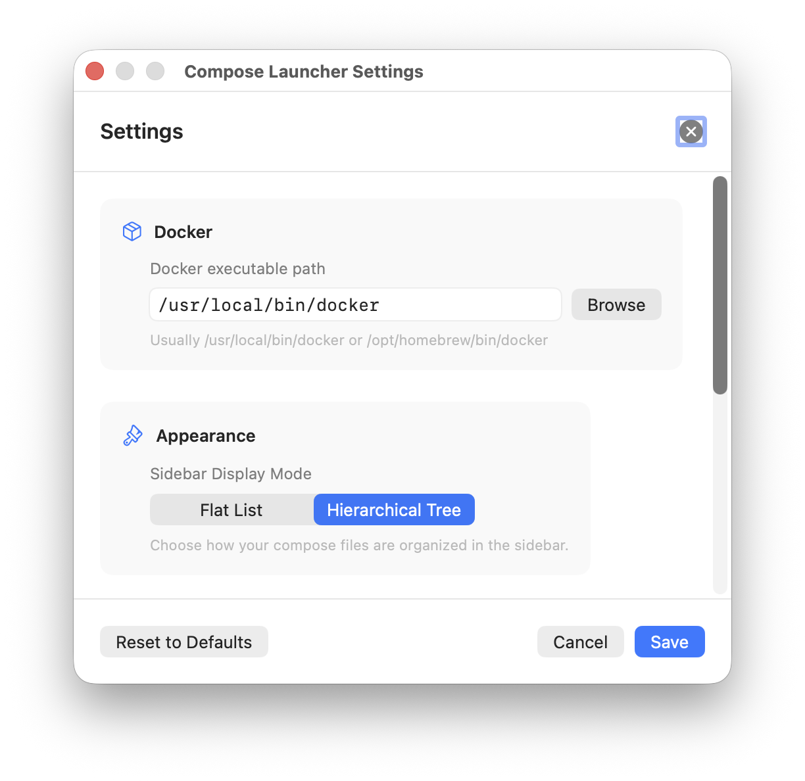

# Compose Launcher

Run and manage multiple Docker Compose projects from one native macOS app.






## The Problem

When you work on multiple Docker Compose projects, local development gets noisy fast:

- you forget which stacks are running
- switching between projects is manual and repetitive
- logs are split across terminal windows
- editing compose files and checking service state happens in different tools

## The Solution

Compose Launcher gives you one desktop workspace to run, inspect, and edit Compose projects:

- launch and stop compose projects from a single sidebar
- monitor service status in one place
- inspect live logs without terminal juggling
- edit compose files directly in-app

## Features

- Import and manage multiple `docker-compose.yml` files
- Directory-aware sidebar tree for quick navigation
- Start/stop controls for selected compose projects
- Built-in YAML editor with save support
- Live log streaming with search/filter
- Configurable log retention (default: 100,000 lines)
- External editor integration
- `.env` file support (auto-detect or custom path per project)
- Persistent settings stored in YAML

## Requirements

- macOS 14.0 or later
- Docker Desktop installed and running
- Xcode 15+ (if building from source)

## Installation

### Run app bundle (recommended)

```bash
./build-app.sh
```

### Build with Swift Package Manager

```bash
cd ComposeLauncher
swift build -c release
```

Binary output:

```text
ComposeLauncher/.build/release/ComposeLauncher
```

### Build/run in Xcode

1. Open the `ComposeLauncher` directory in Xcode.
2. Build with `⌘B` and run with `⌘R`.

## Quick Start

1. Launch the app.
2. Click `+` in the sidebar and select a `docker-compose.yml` file.
3. Click `▶` to start the stack and `■` to stop it.
4. Use **Editor** to edit YAML and **Logs** to inspect container output.

## Use Cases

Compose Launcher is especially useful for:

- microservice development with several local stacks
- API + database + queue development environments
- switching between client/project-specific compose setups
- developers who want GUI-based compose operations on macOS

## Comparison

| Option | Best for |
|--------|----------|
| `docker compose` CLI | Operating one project at a time from terminal |
| Compose Launcher | Managing multiple projects with GUI controls, logs, and editor |

## Why This Exists

Compose Launcher was created to reduce local Docker Compose friction on macOS: fewer terminal tabs, faster context switching, and a clearer view of what is running.

## Keyboard Shortcuts

| Action | Shortcut |
|--------|----------|
| Add Compose File | `⌘O` |
| Start Selected | `⌘R` |
| Stop Selected | `⌘.` |
| Save Editor | `⌘S` |
| Settings | `⌘,` |

## Roadmap

Planned improvements:

- richer project grouping and workspace organization
- deeper service health/status visibility
- expanded log tooling
- packaging/distribution improvements

## Documentation

- [Architecture](ARCHITECTURE.md)
- [FAQ](FAQ.md)
- [Contributing](CONTRIBUTING.md)
- [Release Process](RELEASES.md)

## Contributing

Contributions are welcome. Please open an issue or submit a pull request.

## License

Free for personal use. Commercial use requires the author's permission. Open an issue to get in touch.
