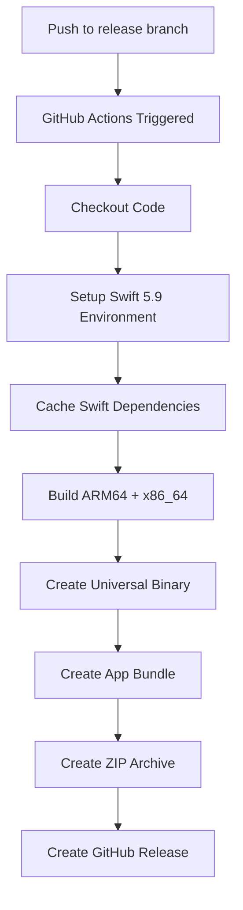

# Release Process

This document describes how releases are built and published for Compose Launcher.

## Automated Releases

Compose Launcher uses GitHub Actions to automatically build and publish releases when code is pushed to the `release` branch.

### Release Workflow



### How to Create a Release

1. **Create a git tag** with the version number:
   ```bash
   git tag v1.0.0
   git push origin v1.0.0
   ```

2. **Push to the release branch**:
   ```bash
   git push origin main:release
   ```

3. **GitHub Actions will automatically**:
   - Build a Universal Binary (Intel + Apple Silicon)
   - Create a ZIP archive
   - Create a GitHub Release with the app attached

### Configuration

| Setting | Value |
|---------|-------|
| Trigger Branch | `release` |
| Version Source | Git tags |
| Architecture | Universal Binary (ARM64 + x86_64) |
| Runner | `macos-14` (M1) |
| Swift Version | 5.9 |

## Output Artifacts

| Artifact | Format | Description |
|----------|--------|-------------|
| `Compose-Launcher-macos.zip` | ZIP archive | Universal Binary .app bundle |

## Code Signing Note

The app is distributed unsigned. Users will need to:

1. Right-click the app and select "Open" on first launch
2. Or run in Terminal:
   ```bash
   xattr -cr "Compose Launcher.app"
   ```

This is standard for open-source macOS apps without paid Apple Developer accounts.

## Manual Build

For local development or manual builds, use the provided script:

```bash
./build-app.sh
```

This creates a local `Compose Launcher.app` bundle and launches it for testing.
